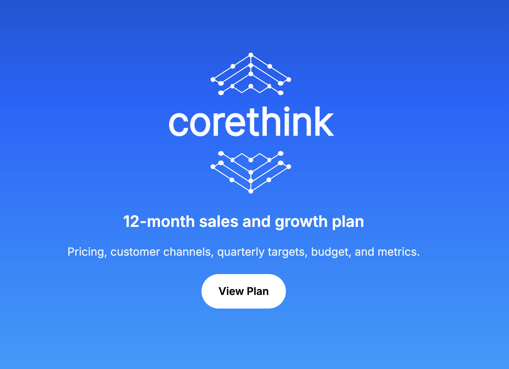

# CoreThink Strategy OS



Interactive **12-month sales and growth plan**: pricing, acquisition, quarterly targets, budget, and metrics. Static site only—data lives in `data/*.json`.

## Quick start

From this folder (`corethink-strategy-os`):

```bash
git clone https://github.com/DylanCkawalec/ct-devrel.git
cd ct-devrel
chmod +x run.sh   # once, if needed
./run.sh
```

Requires **Node 20+**. Opens the dev server; use **View Plan**, then explore **Home** (executive summary) and the other tabs. Or run `npm install && npm run dev` manually.
